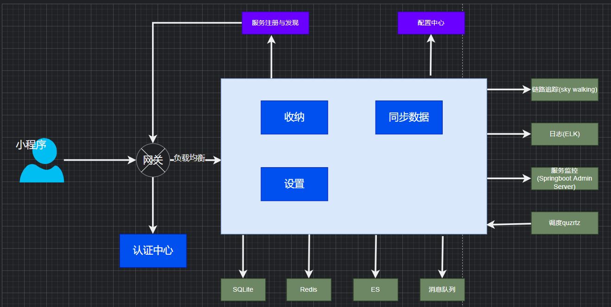

[TOC]

> 选择[ruoyi-cloud](https://doc.ruoyi.vip/ruoyi-cloud/)为基础架构快速开发, 深入了解Cloud相关组建

# 1. 需求部分
- 
- [系统整体架构图](https://note.youdao.com/s/QOnbw7dZ)


- [概要设计](https://note.youdao.com/s/cwBD7PZk)
- [详细设计](https://note.youdao.com/s/Sga2cU5m)

# 2. 系统环境搭建

项目的环境搭建使用docker-compose, 只需要把deploy目录下是所有目录拷贝到自定义目录下, 运行`docker-compose up -d`即可完成环境搭建
- mysql: 所有的初始化sql, 放入init即可
- redis
- nacos: 依赖mysql服务
- nginx

# 3. 页面目录描述

```text
simple-tidy
├── assert(markdown附件)
│   └── jiagoutu.png
├── bin(ruoyi暂留)
├── deploy(环境和应用配置)
│   └── env(环境配置)
│       ├── mysql
│       │   ├── config/(配置)
│       │   ├── data/(数据)
│       │   └── init/(初始化sql)
│       ├── nacos
│       │   └── conf/(配置文件)
│       ├── nginx
│       │   ├── conf/(配置文件)
│       │   └── html/(静态根目录)
│       ├── redis
│       │   └── conf/(配置文件)
│       └── docker-compose.yaml
├── docker(ruoyi暂留)
├── ruoyi-api(业务模块API)
│   ├── ruoyi-api-system/(系统模块)
├── ruoyi-auth(权限认证)
├── ruoyi-common(通用模块)
│   ├── ruoyi-common-core/
│   ├── ruoyi-common-datascope/
│   ├── ruoyi-common-datasource/
│   ├── ruoyi-common-log/
│   ├── ruoyi-common-redis/
│   ├── ruoyi-common-seata/
│   ├── ruoyi-common-security/
│   ├── ruoyi-common-sensitive/
│   ├── ruoyi-common-swagger/
├── ruoyi-gateway(网关)
├── ruoyi-modules(业务模块)
│   ├── ruoyi-file/(文件)
│   ├── ruoyi-gen/(代码生成)
│   ├── ruoyi-job/(定时任务)
│   ├── ruoyi-system/(系统模块)
│   └── pom.xml
├── ruoyi-ui(暂留)
├── ruoyi-visual(图形化管理)
│   ├── ruoyi-monitor(服务监控)
│   └── pom.xml
├── sql
│   ├── quartz.sql
│   ├── ry_20240629.sql
│   ├── ry_config_20240914.sql
│   └── ry_seata_20210128.sql
├── LICENSE
├── PLAN.md
├── pom.xml
└── README.md
```